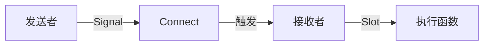
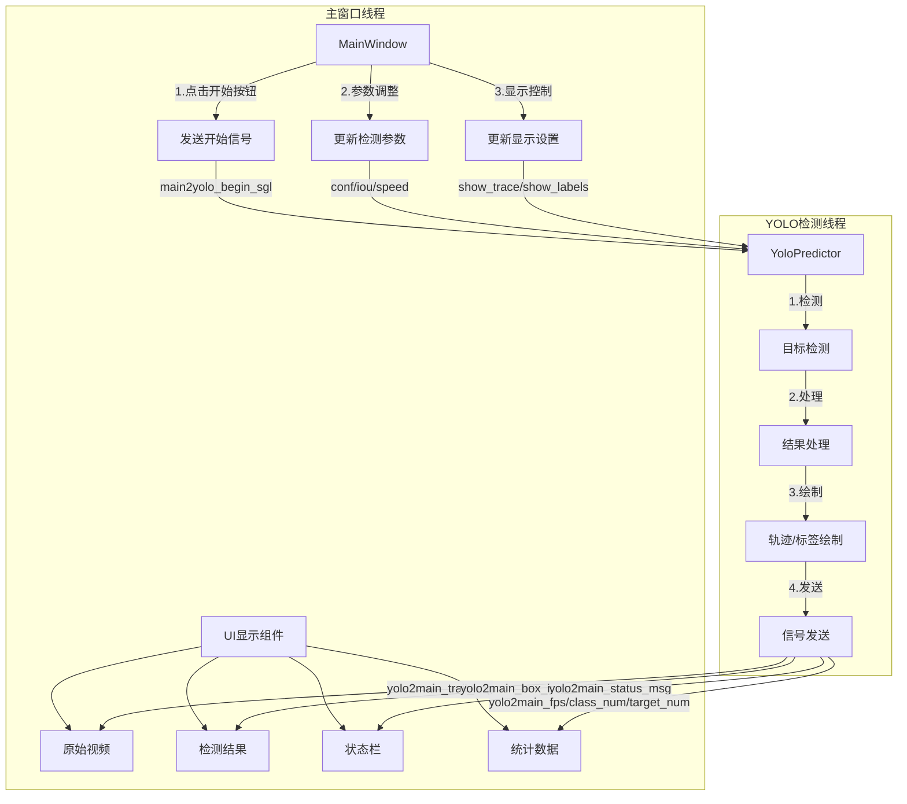
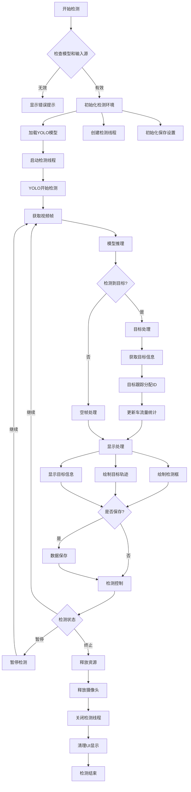
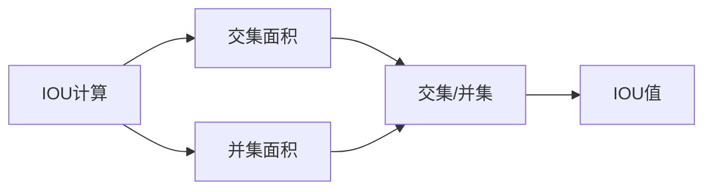
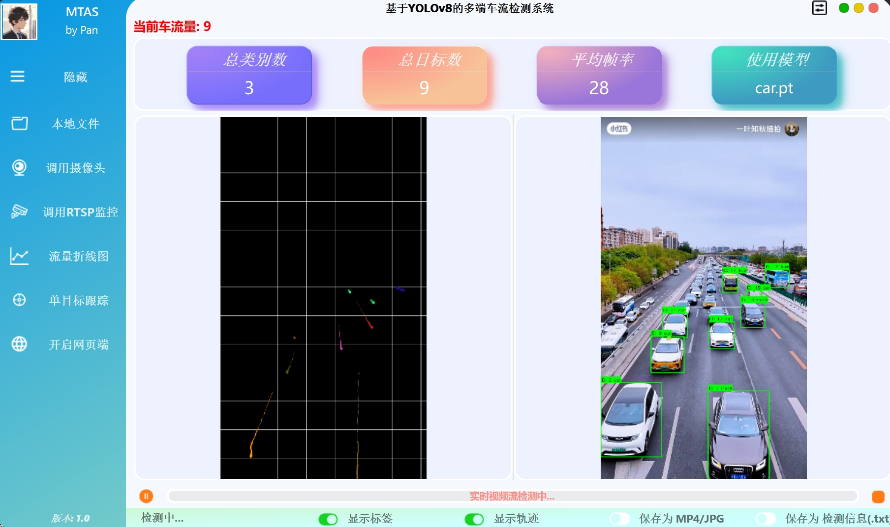

# YOlOV8 检测流程框架

## 项目文件结构说明（客户端）

``` shell
├── main.py                 # 主程序入口，包含主窗口类，客户端UI
├── app.py                  # Web后端服务入口(Flask) 提供Web访问接口，但是这里模型需要手动加载
├── config/
│   ├── config.json        # 配置文件，存储各种初始化参数设置
│   ├── config.txt         # 配置文件的参数解释
│   └── end-back.env       # 服务器配置和数据库配置
│
├── classes/
│   ├── yolo.py            # YOLO检测核心类 主要用了ultralytics的YOLOv8现有类
│   ├── main_config.py     # 配置文件管理类 单例模式
│   ├── car_chart.py       # 车流量图表绘制类
│   ├── paint_trail.py     # 轨迹绘制类
│   └── sql_connect.py     # 数据库操作模块
│
├── models/                 # 模型文件夹
│   └── *.pt/*.engine      # YOLO模型文件
│
├── ui/
│   ├── main_window.py     # 主窗口UI定义
│   ├── ui_function.py     # UI功能函数
│   ├── resources.py       # UI资源文件
│   ├── custom_grips.py    # 自定义窗口控件
│   ├── pop/
│   │   └── pop_box.py     # 弹窗组件
│   ├── toast/
│   │   └── toast.py       # 提示消息组件
│   └── dialog/
│       ├── rtsp_win.py    # RTSP窗口
│       ├── rtsp_dialog.py # RTSP对话框
│       ├── id_win.py      # ID选择窗口
│       └── id_dialog.py   # ID选择对话框
│
├── utils/
│   ├── main_utils.py      # 通用工具函数
│   ├── AtestCamera.py     # 摄像头测试工具
│   ├── Atest.py           # 测试工具
│   └── flask_utils.py     # Flask工具包
│
├── pre_result/            # 检测结果保存目录
│   ├── video_*.mp4        # 保存的视频结果
│   └── image_*.jpg        # 保存的图片结果
│
└── pre_labels/            # 检测标签保存目录
    └── result_*.txt       # 保存的标签文件
```

## 主要原理

### yolo检测和主窗口连接的Qt信号机制

Signal-Slot（信号-槽）是 Qt 的核心机制，用于对象间的通信：

- Signal（信号）：对象发出的通知
- Slot（槽）：接收信号的函数
- Connect：连接信号和槽的方法



在该项目中通过在`yolo.py`定义各项信号，在`main.py`中连接信号和槽函数，当需要发送信号时，调用`yolo.py`中的`emit_res()`函数。接收方为主窗口，触发槽函数之后将执行对应的UI更新函数。

以显示检测图像为例，简单流程如下：

`yolo.py`中的核心检测类为`YoloPredictor`，该类在main中作为`yolo_predict`实例化。

首先要调用`yolo.py`中的检测函数，检测时会调用`emit_res()`函数发送信号，主窗口连接了`yolo.py`中的信号，当检测到结果后，会自动调用`main.py`中连接的槽函数，执行UI更新。从而实时在UI中显示检测结果。

### yolo车辆检测和车流量统计

在`yolo.py`中主要定义了yolo核心检测需要用的函数和信号，引用`ultralytics`的YOLOv8现有类，并进行封装。

#### 主要API

| API                                           | Description                                    |
| --------------------------------------------- | ---------------------------------------------- |
| `run()`                                       | 核心检测函数，启动检测循环，处理每一帧图像     |
| `load_yolo_model()`                           | 加载YOLO模型，如果模型变化会重新加载           |
| `recognize_res(iter_model)`                   | 处理检测结果，返回原图、检测结果和图像尺寸     |
| `res_address(img_res, result, ...)`           | 处理检测到的目标，绘制轨迹和标签，更新统计信息 |
| `creat_labels(detections, img_box, model)`    | 在图像上绘制标签和检测框，返回标签信息         |
| `emit_res(img_trail, img_box)`                | 发送检测结果到主窗口，包括图像和统计信息       |
| `get_class_number(detections)`                | 统计当前帧中不同类别的数量                     |
| `release_capture()`                           | 释放摄像头资源                                 |
| `open_target_tracking(detections, img_res)`   | 开启单目标追踪窗口                             |
| `single_object_tracking(detections, img_box)` | 实现单个目标的追踪功能                         |

信号定义:

| Signal                 | Description                          |
| ---------------------- | ------------------------------------ |
| `yolo2main_trail_img`  | 发送轨迹图像到主窗口                 |
| `yolo2main_box_img`    | 发送带标签和检测框的图像到主窗口     |
| `yolo2main_status_msg` | 发送状态信息(检测/暂停/停止等)       |
| `yolo2main_fps`        | 发送FPS信息                          |
| `yolo2main_class_num`  | 发送当前帧类别数                     |
| `yolo2main_target_num` | 发送当前帧目标数                     |
| `yolo2main_progress`   | 发送检测进度                         |
| `yolo2main_labels`     | 发送检测到的目标结果(每个类别的数量) |

实现目标检测时需要在`main.py`中实例化`YoloPredictor`类，之后利用`yolo.py`中的API来进行检测。

#### 目标检测核心原理

YOLO是一种单阶段目标检测算法，本项目使用YOLOv8。主要包含：

- 输入图像划分为网格
- 每个网格预测边界框和置信度
- 同时预测类别概率

识别框采用`xyxy`格式，置信度为`conf`，类别为`cls`。

```python
# yolo.py
def run(self):
    # 使用YOLOv8进行检测
    model = self.load_yolo_model()
    iter_model = iter(model.track(
        source=self.source,
        iou=self.iou_thres,     # IOU阈值，用于NMS
        conf=self.conf_thres,    # 置信度阈值，过滤低质量检测
    ))
```

- `main.py`中加载模型是更新模型列表，检索`./models`下的所有模型。
- `yolo.py`中加载模型是将模型加载到yolo检测器。

#### 目标跟踪核心原理

项目使用ByteTrack算法进行目标跟踪，主要包含：

1. **卡尔曼滤波运动预测**
   $$X_t = F * X_{t-1} + w$$
   - $X_t$: 当前状态
   - $F$: 状态转移矩阵
   - $w$: 过程噪声
   ```python
   # ultralytics中实现
   X_t = F * X_{t-1} + w  # 卡尔曼滤波预测
   ```

2. **目标关联匹配**
   - IOU匹配度计算
   - 匹配度矩阵: $M[i,j] = IOU(pred_i, det_j)$
   
   ```python
   # yolo.py中
   detections = sv.Detections.from_ultralytics(result)
   detections.tracker_id = result.boxes.id.cpu().numpy().astype(int)
   ```

3. **ID管理**
   - 高置信度优先匹配
   - 级联匹配策略
   ```python
   # 在paint_trail.py中的轨迹记录
   dic_for_drawing_trails[id] = deque(maxlen=64)  # 为每个ID维护轨迹队列
   ```

具体就是通过卡尔曼滤波预测目标位置，然后通过IOU匹配度矩阵进行匹配，最后根据置信度进行ID分配。每个被跟踪的目标都会被分配一个ID，并且会维护一个轨迹队列。这样即使目标短暂离开画面，再重新出现时，也能根据ID匹配到原来的轨迹，避免重复计数。

#### 车流量统计核心原理

1. **瞬时车流量**
   $Q(t) = N(t)$
   - $Q(t)$: t时刻车流量
   - $N(t)$: t时刻检测到的车辆数

2. **平均车流量**
   $$Q_{avg} = (1/T) * ∫[t0,t0+T] N(t)dt$$
   - $T$: 统计时间间隔
   - $N(t)$: 时间函数

```python
# yolo.py
def res_address(self, img_res, result, ...):
    if result.boxes.id is not None:
        # 当前帧车辆数量
        self.sum_of_count = len(detections.tracker_id)
```
本项目通过上述函数获取当前帧车辆数量，并将其作为瞬时车流量。

3. **统计方法-时间窗口统计**
   - 窗口大小: $W$
   - 采样点集: $t_i, N_i$
   - 平均车流量: $$Q_w = (1/W) * Σ N_i$$

时间窗口统计的原理就是将每个时间点或者时间段的瞬时车流量进行统计，然后计算平均值。
可以得到一段时间内的平均车流量，从而反映车流量的变化趋势。

```python
# yolo.py
# 记录每个时间点的车流量
now = datetime.datetime.now()
new_time = now.strftime("%Y-%m-%d %H:%M:%S")
if new_time not in x_axis_time_graph:
    x_axis_time_graph.append(new_time)
    y_axis_count_graph.append(self.sum_of_count)

# car_chart.py中绘制统计图
plt.plot(x_axis_time_graph, y_axis_count_graph)
```

上述代码中，`x_axis_time_graph`记录了每个时间点，`y_axis_count_graph`记录了每个时间点的车流量。每个时间点是以秒为单位，时间窗口大小为1秒，统计每秒的车流量。因此通过绘制折线图可以直观地看到车流量的变化趋势。

4. **预警机制-阈值判断**
   $$
   Alert = \begin{cases}
      True,  & \text{if } Q(t) > Q_threshold \\
      False, & \text{if } Q(t) ≤ Q_threshold
   \end{cases}
   $$

```python
# main.py
def Target_setText(self, num):
    if (int(num) > int(self.car_threshold)):
        self.char_label.setStyleSheet("color: red;")
    else:
        self.char_label.setStyleSheet("color: green;")
```

直接通过判断当前时间点的车流量大小是否超过设定的阈值，来决定是否触发预警。

#### 精度优化

1. **非极大值抑制(NMS)**
   $$IOU = Area_overlap / Area_union$$

```python
# 在YOLOv8中通过iou参数控制
model.track(source=self.source, iou=self.iou_thres)
```

通过调整IOU参数可以控制检测框的精度，IOU越大，检测框越紧密，精度越高。但可能漏检。

2. **置信度过滤**
   $$Score = P(obj) * P(cls|obj)$$

```python
# 通过conf参数控制
model.track(source=self.source, conf=self.conf_thres)
```

小于置信度阈值的检测结果会被过滤掉。

3. **轨迹平滑**
   $$X_smooth = α * X_pred + (1-α) * X_meas$$
   - $X_smooth$: 平滑后的轨迹
   - $X_pred$: 预测位置
   - $X_meas$: 测量位置
   - $α$: 平滑系数

```python
# paint_trail.py中的轨迹绘制
def draw_trail(img, bbox, names, object_id, identities):
    # 动态调整轨迹线条粗细，实现平滑效果
    thickness = int(np.sqrt(64 / float(i + i)) * 1.5)
    img = cv2.line(img, points[i - 1], points[i], color, thickness)
```

描述检测车辆轨迹时，通过预测位置和测量位置的加权平均，以及调整线条粗细，让轨迹更加平滑。

## 主要代码和流程

### yolo检测和主窗口连接的Qt信号机制

#### 信号定义

```python
# classes/yolo.py
class YoloPredictor(QObject):
    # 定信号
    yolo2main_trail_img = Signal(np.ndarray)    # 轨迹图像
    yolo2main_box_img = Signal(np.ndarray)      # 检测框图像
    yolo2main_status_msg = Signal(str)          # 状态信息
    yolo2main_fps = Signal(str)                 # FPS信息
    yolo2main_class_num = Signal(int)           # 类别数
    yolo2main_target_num = Signal(int)          # 目标数
```

#### 信号连接

```python
# main.py
def yolo_init(self):
    # 连接信号到对应的槽函数
    self.yolo_predict.yolo2main_trail_img.connect(
        lambda x: self.show_image(x, self.pre_video)
    )
    self.yolo_predict.yolo2main_box_img.connect(
        lambda x: self.show_image(x, self.res_video)
    )
    self.yolo_predict.yolo2main_status_msg.connect(
        lambda x: self.show_status(x)
    )
```

#### 信号发送

```python
# classes/yolo.py
def emit_res(self, img_trail, img_box):
    # 发送信号
    self.yolo2main_trail_img.emit(img_trail)
    self.yolo2main_box_img.emit(img_box)
    self.yolo2main_class_num.emit(self.class_num)
    self.yolo2main_target_num.emit(self.sum_of_count)
```

#### 信号交互流程



1. **主窗口 -> YOLO**
   - main2yolo_begin_sgl: 开始检测
   - 参数设置: IOU/置信度/延时
   - 显示控制: 轨迹/标签开关

2. **YOLO -> 主窗口**
   - yolo2main_trail_img: 轨迹图像
   - yolo2main_box_img: 检测框图像
   - yolo2main_status_msg: 状态信息
   - yolo2main_fps: FPS信息
   - yolo2main_class_num: 类别数
   - yolo2main_target_num: 目标数

### yolo车辆检测和车流量统计

#### YOLO初始化

```python
# main.py中的YOLO初始化
def yolo_init(self):
    # 1. 实例化YOLO检测器
    self.yolo_predict = YoloPredictor()
    self.select_model = self.model_box.currentText()
    # 2. 创建YOLO线程
    self.yolo_thread = QThread()
    self.yolo_predict.moveToThread(self.yolo_thread)
    # 3. 连接信号 显示图像
    self.yolo_predict.yolo2main_trail_img.connect(lambda x: self.show_image(x, self.pre_video))
    self.yolo_predict.yolo2main_box_img.connect(lambda x: self.show_image(x, self.res_video))
    # 更新状态和数据
    self.yolo_predict.yolo2main_status_msg.connect(self.show_status)
    self.yolo_predict.yolo2main_fps.connect(self.fps_label.setText)
    self.yolo_predict.yolo2main_class_num.connect(lambda x: self.Class_num.setText(str(x)))
    self.yolo_predict.yolo2main_target_num.connect(lambda x: self.Target_setText(x))
```

#### 检测控制流程



#### 开始/暂停和终止检测

开始检测，通过`run_button`按钮控制，点击开始按钮启动检测线程`yolo_thread`，并发送开始信号`main2yolo_begin_sgl`。

```python
def run_or_continue(self): 
    # 开始检测
    if self.run_button.isChecked():
        self.yolo_thread.start()
        self.main2yolo_begin_sgl.emit()
    # 暂停检测
    else:
        self.yolo_predict.continue_dtc = False
```

终止检测，关闭线程，同时重置UI。

```python
def stop(self):
    # 释放摄像头
    self.yolo_predict.release_capture()
    # 结束线程
    self.yolo_thread.quit()
    # 重置UI
    self.run_button.setChecked(False)
    self.pre_video.clear()
    self.res_video.clear()
```

#### 车流量统计实现

车流量检测，通过`yolo_predict.sum_of_count`获取当前帧车辆数量，并更新到UI中，以统计当前秒的车流量。

```python
# yolo.py
def run(self):
    # 1. 加载模型
    model = self.load_yolo_model()
    # 2. 获取检测迭代器
    iter_model = iter(model.track(
        source=self.source,
        show=False,
        stream=True,
        iou=self.iou_thres,
        conf=self.conf_thres
    ))
    # 3. 处理每一帧
    while True:
        result = next(iter_model)
        if result.boxes.id is not None:
            # 从ultralytics结果转换为supervision格式
            detections = sv.Detections.from_ultralytics(result)
            # 获取跟踪ID
            detections.tracker_id = result.boxes.id.cpu().numpy().astype(int)
            # 获取检测信息
            id = detections.tracker_id  # 目标ID
            xyxy = detections.xyxy     # 边界框坐标
            self.sum_of_count = len(id)  # 当前帧目标总数
```

目标跟踪，使用ByteTrack算法进行目标跟踪，获取跟踪ID。防止重复计数。

```python
# 使用ByteTrack算法进行目标跟踪
model.track(source=self.source)  # track方法会自动为每个目标分配唯一ID

# 获取跟踪结果
detections.tracker_id  # 每个目标的唯一ID
detections.class_id   # 目标类别
detections.confidence # 置信度
```


实时统计

```python
def res_address(self, img_res, result, ...):
    if result.boxes.id is not None:
        detections = sv.Detections.from_ultralytics(result) 
        # 当前帧车辆数量
        self.sum_of_count = len(detections.tracker_id)
        # 记录时间点数据(用于绘制流量图)
        now = datetime.datetime.now()
        new_time = now.strftime("%Y-%m-%d %H:%M:%S")
        if new_time not in x_axis_time_graph:
            x_axis_time_graph.append(new_time)
            y_axis_count_graph.append(self.sum_of_count)
```

数据更新和车流量预警

```python
def Target_setText(self, num):
    # 更新车流量显示
    self.Target_num.setText(str(num))
    self.char_label.setText(f"当前车流量: {num}")
    # 车流量预警
    if (int(num) > int(self.car_threshold)):
        self.char_label.setStyleSheet("color: red;")
    else:
        self.char_label.setStyleSheet("color: green;")
```

绘制流量图

```python
def show_traffic_graph(self):
    self.draw_thread.start()    # 启动绘图线程
    self.is_draw_thread = True
```

#### 数据保存机制

数据的保存主要通过检查UI中的保存按钮的选中状态，来决定是否保存数据。当保存按钮被选中时，通过信号机制将保存标志位设置为True，在检测线程中根据该标志位进行数据保存。

检测视频保存

```python
def is_save_res(self):
    if self.save_res_button.checkState() == Qt.CheckState.Checked:
        self.yolo_predict.save_res = True
        self.show_status('提示: 监测结果将会被保存')
```

检测标���保存

```python
def is_save_txt(self):
    if self.save_txt_button.checkState() == Qt.CheckState.Checked:
        self.yolo_predict.save_txt = True
        self.show_status('提示: 标签信息将会被保存')
```

标签保存格式

```python
# 完整记录包含
- 检测时间
- 目标ID
- 目标类别
- 置信度
- 当前总目标数
```

### 检测参数说明

#### IOU (Intersection over Union)

IOU（交并比）是目标检测中用于衡量两个边界框重叠程度的指标：

- 计算方式：两个框的交集面积 / 两个框的并集面积
- 取值范围：0~1，越大表示重叠度越高



```python
# main.py中的参数绑定
self.iou_spinbox.valueChanged.connect(lambda x:self.change_val(x, 'iou_spinbox'))
self.iou_slider.valueChanged.connect(lambda x:self.change_val(x, 'iou_slider'))

# yolo.py中应用
self.iou_thres = 0.45  # 默认IOU阈值
# 用于模型推理时过滤重叠框
model.track(source=self.source, iou=self.iou_thres)
```

- IOU用于非极大值抑制(NMS)过程，过滤重叠的检测框
- 值越大，保留的框越少，检测越严格

#### Speed Box (延时控制)

- 单位：毫秒(ms)
- 作用：控制检测和显示的速度
- 可调节范围：0~100ms

```python
# main.py中的参数绑定
self.speed_spinbox.valueChanged.connect(lambda x:self.change_val(x, 'speed_spinbox'))
self.speed_slider.valueChanged.connect(lambda x:self.change_val(x, 'speed_slider'))

# yolo.py中应用
self.speed_thres = 0.01  # 默认延时值(ms)
# 在发送结果前增加延时
time.sleep(self.speed_thres/1000)  # 转换为秒
```

通过调节延时，可以平衡检测性能和显示效果，使显示更流畅。


#### 参数调节实现

##### UI控件绑定

```python
def model_bind(self):
    # IOU调节
    self.iou_spinbox.valueChanged.connect(lambda x:self.change_val(x, 'iou_spinbox'))
    self.iou_slider.valueChanged.connect(lambda x:self.change_val(x, 'iou_slider'))
    # Speed调节
    self.speed_spinbox.valueChanged.connect(lambda x:self.change_val(x, 'speed_spinbox'))
    self.speed_slider.valueChanged.connect(lambda x:self.change_val(x, 'speed_slider'))
```

##### 参数更新逻辑

当用户通过UI控件调节参数时，通过`change_val`函数更新参数值，并通过信号机制同步到YOLO检测器中。

```python
def change_val(self, x, flag):
    if flag == 'iou_spinbox':
        self.iou_slider.setValue(int(x*100))    
    elif flag == 'iou_slider':
        self.iou_spinbox.setValue(x/100) 
        self.yolo_predict.iou_thres = x/100
        
    elif flag == 'speed_spinbox':
        self.speed_slider.setValue(x)
    elif flag == 'speed_slider':
        self.speed_spinbox.setValue(x)
        self.yolo_predict.speed_thres = x
```

##### 配置保存

当用户关闭程序时，通过`closeEvent`函数保存参数到配置文件中。下次再开启时会直接加载配置文件中的参数。

```python
def load_config(self):
    # 从配置文件加载参数
    self.iou_slider.setValue(self.config.iou * 100)
    self.speed_slider.setValue(self.config.rate)
    
def closeEvent(self):
    # 保存参数到配置文件
    self.config.iou = self.yolo_predict.iou_thres
    self.config.rate = self.yolo_predict.speed_thres
    self.config.save_config()
```

## 主要修改

### yolo.py 中更改对目标的绘图函数

```python
if (self.show_labels == True) and (self.class_num != 0):
    # 手动绘制边界框和标签
    for xyxy, label in zip(detections.xyxy, labels_draw):
        x1, y1, x2, y2 = map(int, xyxy)
        # 绘制边界框
        cv2.rectangle(img_box, (x1, y1), (x2, y2), (0, 255, 0), 2)
        # 绘制标签背景
        (label_width, label_height), _ = cv2.getTextSize(label, cv2.FONT_HERSHEY_SIMPLEX, 0.5, 1)
        cv2.rectangle(img_box, (x1, y1 - label_height - 10), (x1 + label_width, y1), (0, 255, 0), -1)
        # 绘制标签文本
        cv2.putText(img_box, label, (x1, y1 - 5), cv2.FONT_HERSHEY_SIMPLEX, 0.5, (0, 0, 0), 1)
```

更改绘图函数是因为原来的supervision库的绘图函数绘图版本较低，与现有库冲突，需要直接改成使用opencv绘图。

### main.py 中将detection的接口改为`from_ultralytics`

```python
detections = sv.Detections.from_ultralytics(result)
detections.tracker_id = result.boxes.id.cpu().numpy().astype(int)
```

新版本yolo已将detection的接口改为`from_ultralytics`，所以需要同步修改。

### app.py 中将检测出的标签格式和前端对应

```python
        # 修改标签格式
        labels = []
        for xyxy, confidence, class_id, tracker_id in zip(
            detections.xyxy,
            detections.confidence,
            detections.class_id,
            detections.tracker_id
        ):
            x1, y1, x2, y2 = map(int, xyxy)
            label = f"ID: {tracker_id} Class: {model.model.names[class_id]} Confidence: {confidence:.2f} Coordinates: {x1} {y1} {x2} {y2}"
            labels.append(label)
```

源程序中的后端效果是和客户端相同的，相比主要缺少了以下部分：

1. **显示功能**
   - 没有实时视频显示界面
   - 没有实时车流量图表显示
   - 没有轨迹显示功能
   - 没有单目标追踪窗口

2. **控制功能**
   - 没有检测参数实时调整(IOU/置信度)
   - 没有检测速度控制
   - 没有暂停/继续功能
   - 没有显示开关(标签/轨迹)

3. **输入源选择**
   - 没有本地摄像头选择
   - 没有RTSP流输入接口
   - 没有视频文件选择功能
   - 只保留了图片上传和URL输入

4. **数据保存**
   - 没有视频保存功能
   - 没有轨迹保存功能
   - 标签保存格式简化
   - 结果只返回JSON格式

5. **实时统计**
   - 没有FPS显示
   - 没有实时车流量预警
   - 没有类别数量统计
   - 统计功能由数据库实现

6. **模型管理**
   - 没有模型动态加载
   - 没有模型文件监控
   - 使用固定模型路径
   - 不支持模型切换

主要原因：
1. 作为后端服务，主要提供API接口
2. 减少资源占用，提高并发性能
3. 部分功能由前端实现
4. 数据持久化由数据库实现

### ffmpeg实现本地视频推流并且在程序中读取

由于实际网络摄像头输入的视频流格式绝大多数都是rtsp格式的，因此本项目要掉要监控摄像头视频时需要读取rtsp视频流。

使用ffmpeg将本地视频推流成rtsp格式，再用本程序读入即可。

安装ffmpeg和rtsp软件之后进行本地视频推流。

先启动rtsp程序`mediamtx.exe`，之后到ffmpeg程序目录，将要推流的视频放到目录下，打开终端输入：

``` shell
ffmpeg -re -stream_loop -1 -i test2.mp4 -c copy -f rtsp rtsp://10.81.85.215:8554/video
```

`test2.mp4`为本地视频，ip地址需要是本地的ip地址，因为没有搭建服务器，因此需要把视频流推到本地。

8554往往是rtsp程序打开后的tcp端口，这个根据实际情况修改。

完成推流之后在项目中打开监控摄像头即可读取视频流并检测。

