# 一、相关技术和工具

开发工具：VS Code、conda、Vue、Node.js、MySQL
插件：Python、Vue
媒体播放器：VLC Media Player  （用来模拟rtsp视频流）
对象检测：YOLO v8   
开发语言：Python、Vue
图像处理：OpenCV

# 二、整体思路

1. 下载一段有车辆行驶的视频
2. 用VLC工具和rtsp工具、ffmpeg软件转换、推流视频文件，以rtsp流形式播放，用来模拟现场摄像头的视频流。
3. 用OpenCV截图视频流的图像，用yolov8模型推理、进行检测识别。 
4. 利用YOLO v8的track功能实现对车流实时计数。车流量检测主要采用时间窗口统计，对每个时间点检测到的车辆数进行实时统计并绘制实时的车流量-时间曲线，方便直接观察。
5. 设置了前后端和本地客户端三端共连。
6. 前后端通过数据库连接，后端将检测数据发送到数据库后，前端接收数据并显示推理结果。
7. 根据检测车辆的类型，从大模型知识库中查询相关的信息，显示在页面上。

# 三、项目功能简介

## 本地客户端（后端）

本地UI用PySide6开发，用于实时显示检测结果，包括实时车流量，实时检测结果，实时检测图像等。

**UI界面**

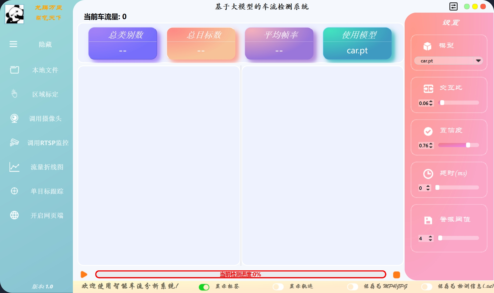

界面中主要可以设置的功能：

- 左侧菜单栏：
  - 选择本地文件可以读取本地视频文件进行检测
  - 选择区域标定主要是打开手动标定接口，对当前的视频进行检测区域标定
  - 选择摄像头调用本地或者外接摄像头进行检测
  - 选择调用RTSP监控输入RTSP流模拟实时的监控检测
  - 流量折线图可以实时反映当前时刻的车流量-时间关系
  - 单目标跟踪通过输入目标车辆ID，将目标车辆单独显示
  - 开启网页端会调用前端接口，打开网页

- 右侧控制栏:
  - 模型下拉框可以自动检索目录下的所有pt或者engine模型文件，自由选择车辆检测模型
  - 交互比是指IOU阈值，用于NMS极大值抑制
  - 置信度阈值是指检测结果置信度的阈值，用于过滤低质量检测结果
  - 设置短暂延迟是为了防止检测结果过于频繁，以免影响后续的检测结果
  - 设置警报阈值是指当检测车辆超过该阈值时，认为触发警报发送给前端
  
- 下方标签：
  - 是否显示检测标签信息
  - 是否显示检测轨迹
  - 是否保存检测结果
  - 是否保存检测标签信息

**数据库建立和连接**

通过编写sql文件创建一个本地数据库，并创建三个表，分别用于存放用户、警报信息和监控信息。后端用python的flask框架和mysql数据库连接，实现后端与前端的数据交互。

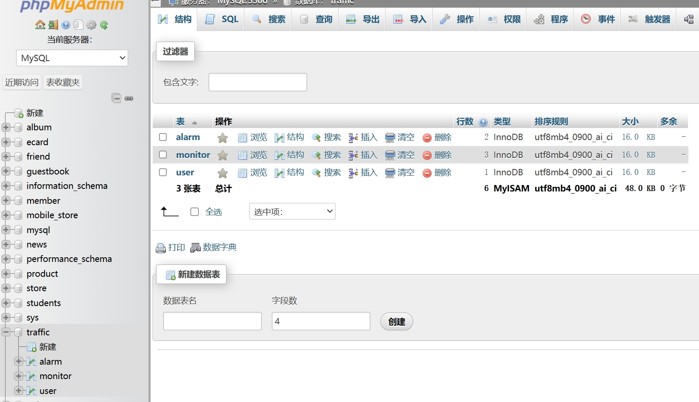

**标定ROI灵活选取检测区域**

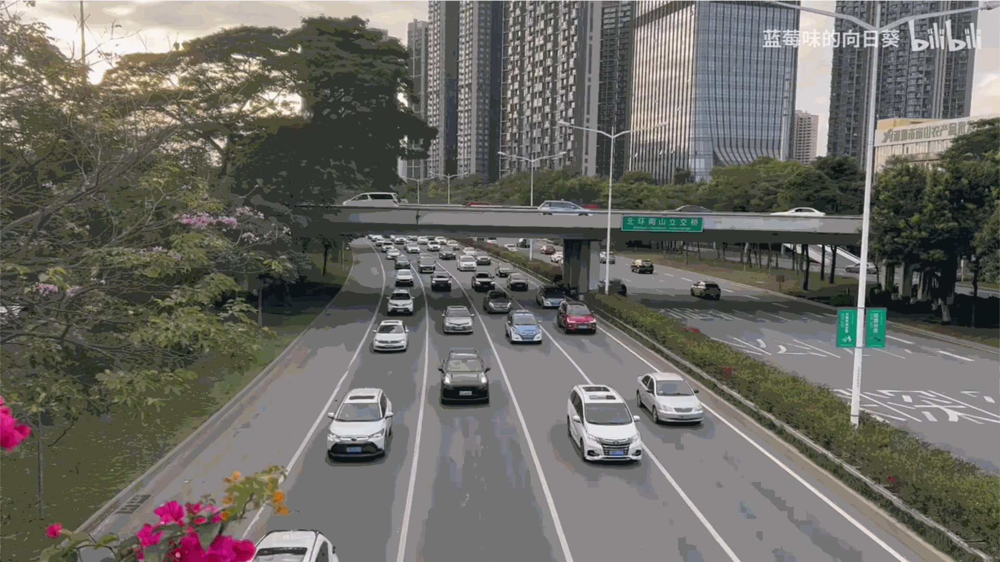

通过一个接口实现对当前读取视频的手动标定，灵活选择ROI区域，同时也避免了检测区域过大，同时检测多个车道的情况。

**读取本地视频或图片并检测**


勾选显示轨迹标签之后，检测车辆的同时，会自动绘制出检测车辆的轨迹。


另外可以显示出实时的车流量-时间折线图，方便直接观察。

**摄像头调用**

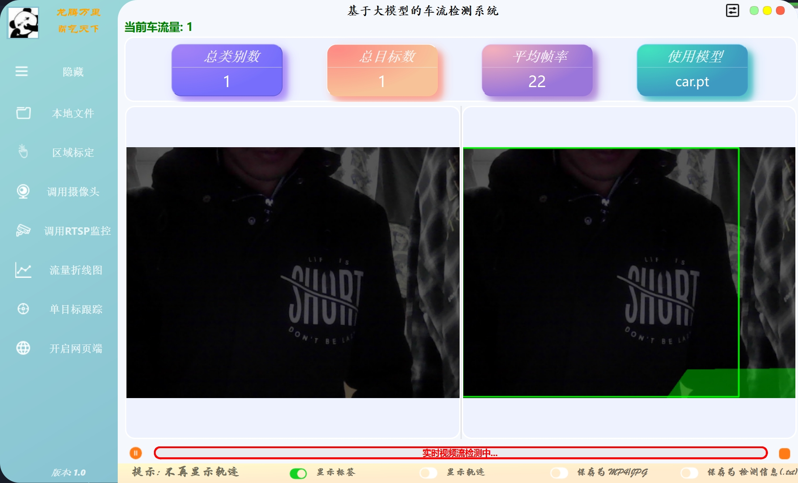

摄像头默认使用了本机的摄像头打开。如果需要，也可以设置外接摄像头并进行检测。

**读取RTSP模拟监控视频流并检测**


使用ffmpeg对本地视频进行推流，由于没有搭建服务器，因此将视频推流到本地的rtsp端口，以本机IP地址为目标，实现rtsp视频流的模拟。

推流代码示例：

```shell
ffmpeg -re -stream_loop -1 -i test2.mp4 -c copy -f rtsp rtsp://10.81.85.215:8554/video
```

其中，test2.mp4为本地视频，ip地址需要是本地的ip地址。
`rtsp://10.81.85.215:8554/video`就是rtsp视频流的目标地址了。

## 前端-游客端

游客端搭建在前端，主要是为了上传、展示检测结果，从上文的客户端UI界面中可以启动游客端。

**UI界面**


游客端前端UI界面采用Vue3框架开发，在主界面有一个照片轮播效果。

下拉页面可以看到上传图片和开启摄像头功能。上传图片是对图片进行一个车辆检测，并将检测信息直接显示。

在页面最下方是收集了一些实际的车辆统计数据，做成静态图表格式，目前还没有进行动态绑定，后续工作应当将这些图标也和数据库数据动态绑定。

**车流检测**

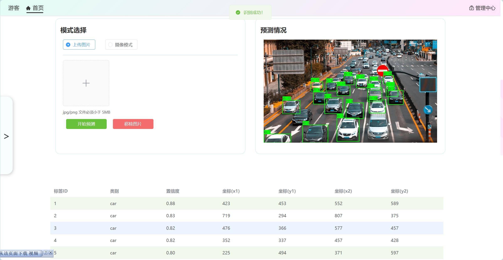

用户上传图片后，可以对图片进行实时的检测，并返回详细检测信息。同时可以通过摄像头进行实时的检测，返回的检测信息也是实时的。

## 前端-管理员端

除了游客端，我们也提供了管理员端，主要负责后端数据的管理，包括用户管理、警报信息管理、监控信息管理等。

**UI界面**

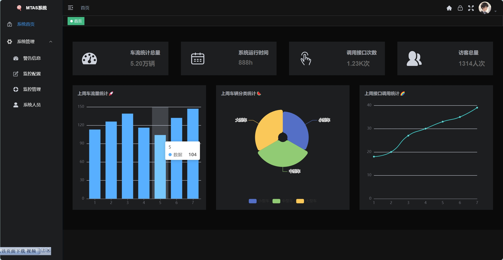

管理员端首页通过数据库记录的数据展示近期的车流量统计数据，车辆分析数据和本系统接口调用次数等信息。

另外管理页面中还有管理警告信息、监控配置、监控管理和系统人员等功能信息。

**监控配置**

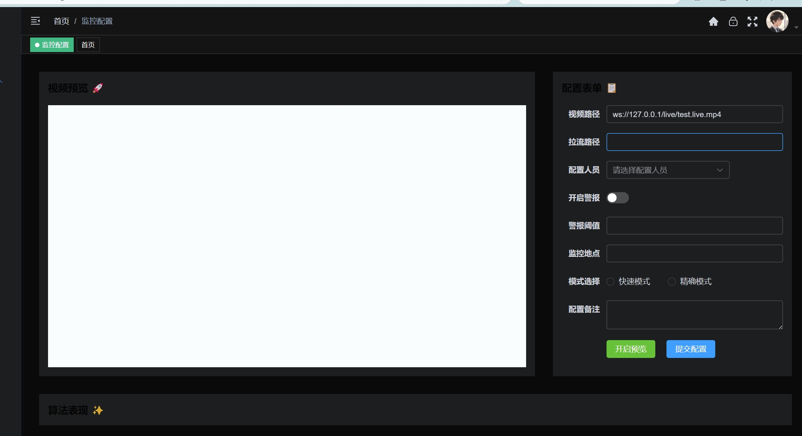

管理员可以在此配置监控信息流地址，以及监控地点、警报阈值等。当该监控监测到车流量超过阈值时，可以发送警报信息给前端。

**监控管理**

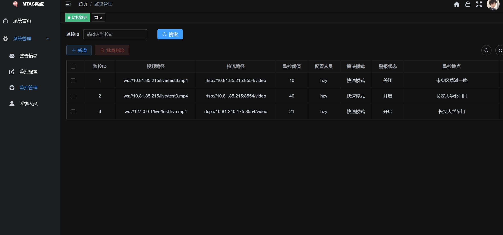

监控管理页面显示管理员已经配置的所有监控信息，包括监控流地址、监控地点、警报阈值等、配置人员等等。

**警告信息**

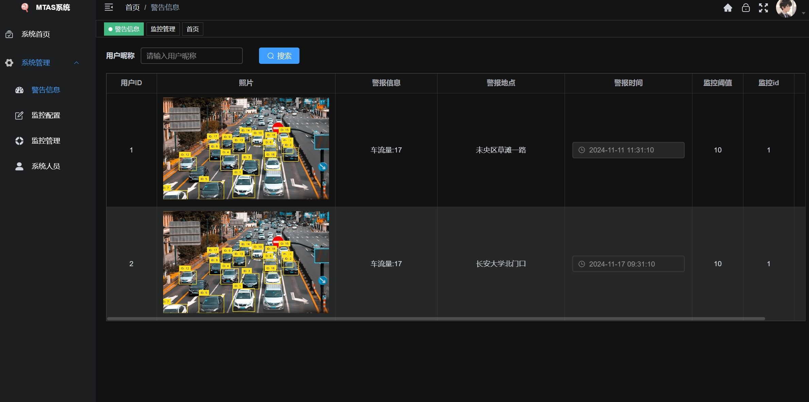

警告信息页面将会实时显示任意一个监控页面传来的报警信息，包括报警时间，报警地点等，方便管理员查看。

# 四、项目核心功能流程

### 对客户端项目文件结构的说明

``` shell
├── main.py                 # 主程序入口，包含主窗口类，客户端UI
├── app.py                  # Web后端服务入口(Flask) 提供Web访问接口，但是这里模型需要手动加载
├── config/
│   ├── config.json        # 配置文件，存储各种初始化参数设置
│   ├── config.txt         # 配置文件的参数解释
│   └── end-back.env       # 服务器配置和数据库配置
│
├── classes/
│   ├── yolo.py            # YOLO检测核心类 主要用了ultralytics的YOLOv8现有类
│   ├── main_config.py     # 配置文件管理类 单例模式
│   ├── car_chart.py       # 车流量图表绘制类
│   ├── paint_trail.py     # 轨迹绘制类
│   └── sql_connect.py     # 数据库操作模块
│
├── models/                 # 模型文件夹
│   └── *.pt/*.engine      # YOLO模型文件
│
├── ui/
│   ├── main_window.py     # 主窗口UI定义
│   ├── ui_function.py     # UI功能函数
│   ├── resources.py       # UI资源文件
│   ├── custom_grips.py    # 自定义窗口控件
│   ├── pop/
│   │   └── pop_box.py     # 弹窗组件
│   ├── toast/
│   │   └── toast.py       # 提示消息组件
│   └── dialog/
│       ├── rtsp_win.py    # RTSP窗口
│       ├── rtsp_dialog.py # RTSP对话框
│       ├── id_win.py      # ID选择窗口
│       └── id_dialog.py   # ID选择对话框
│
├── utils/
│   ├── main_utils.py      # 通用工具函数
│   ├── AtestCamera.py     # 摄像头测试工具
│   ├── Atest.py           # 测试工具
│   └── flask_utils.py     # Flask工具包
│
├── pre_result/            # 检测结果保存目录
│   ├── video_*.mp4        # 保存的视频结果
│   └── image_*.jpg        # 保存的图片结果
│
└── pre_labels/            # 检测标签保存目录
    └── result_*.txt       # 保存的标签文件
```

##### 算法精度优化

1. 非极大值抑制(NMS)

$$ IOU = \frac{A \cap B}{A \cup B} $$

``` python
# 在YOLOv8中通过iou参数控制
model.track(source=self.source, iou=self.iou_thres)
```
通过调整IOU参数可以控制检测框的精度，IOU越大，检测框越紧密，精度越高。但可能漏检。

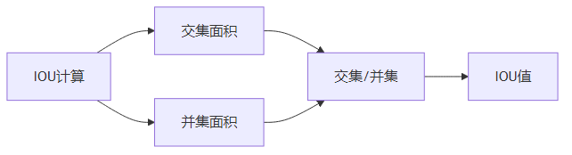

2. 置信度过滤

$$ Score = P_{obj} * P_{cls} $$

``` python
# 通过conf参数控制
model.track(source=self.source, conf=self.conf_thres)
```

小于置信度阈值的检测结果会被过滤掉。

3. 轨迹平滑

$$ X_smooth = \alpha * X + (1 - \alpha) * X_{smooth} $$

-	$X_{smooth}$ : 平滑后的轨迹
-	$X$ : 预测位置
-	$X_{measure}$ : 测量位置
-	$\alpha$ : 平滑系数

``` python
# paint_trail.py中的轨迹绘制
def draw_trail(img, bbox, names, object_id, identities):
    # 动态调整轨迹线条粗细，实现平滑效果
    thickness = int(np.sqrt(64 / float(i + i)) * 1.5)
    img = cv2.line(img, points[i - 1], points[i], color, thickness)
```

描述检测车辆轨迹时，通过预测位置和测量位置的加权平均，以及调整线条粗细，让轨迹更加平滑。

**检测控制流程**

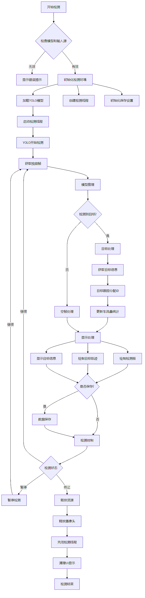

### ffmpeg实现本地视频推流并且在程序中读取和轨迹平滑

由于实际网络摄像头或者监控输入的视频流格式绝大多数都是**rtsp**格式的，因此本项目要调用监控摄像头视频时需要读取rtsp视频流。

使用ffmpeg将本地视频推流成rtsp格式，再用本程序读入即可。
安装ffmpeg和rtsp软件之后进行本地视频推流。
先启动rtsp程序mediamtx.exe，之后到ffmpeg程序目录，将要推流的视频放到目录下，打开终端输入：

``` shell
ffmpeg -re -stream_loop -1 -i test2.mp4 -c copy -f rtsp rtsp://10.81.85.215:8554/video
```

test2.mp4为本地视频，ip地址需要是本地的ip地址，因为没有搭建服务器，因此需要把视频流推到本地。
8554往往是rtsp程序打开后的tcp端口，这个根据实际情况修改。

完成推流之后在项目中打开监控摄像头即可读取视频流并检测。

轨迹平滑通过预测位置（卡尔曼滤波）和测量位置的加权平均，以及动态调整线条粗细、颜色，让轨迹更加平滑。读取推流视频效果如下：

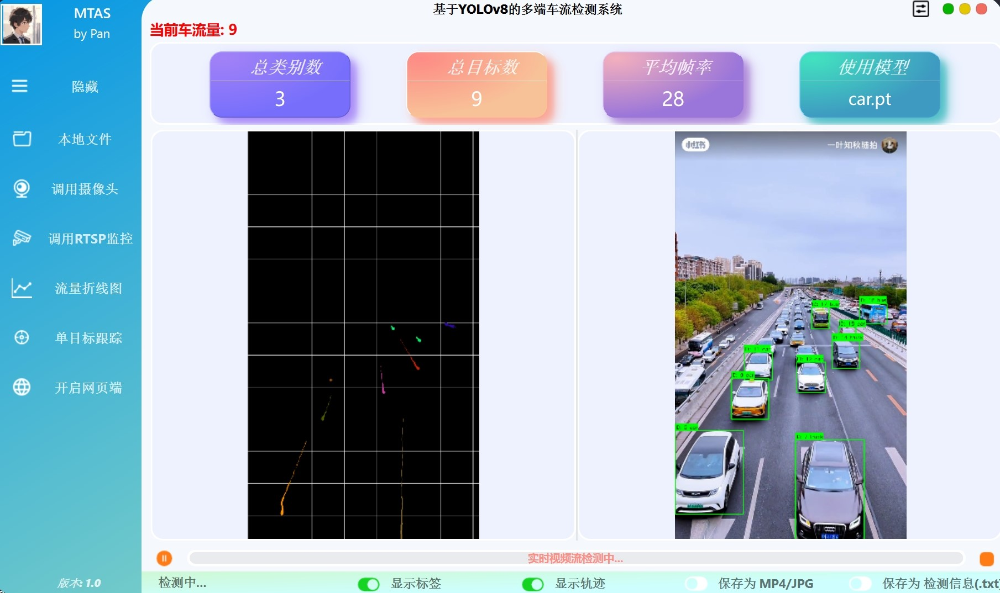

### 创建ROI区域以适应特定区域车流量检测

由于很多场景下，在摄像机或者视频区域中会有多个车道或者其他干扰区域，如果将这些车辆全部识别统计车流量是没有意义的，因此我们针对特定应用场景，需要手动创建一个感兴趣ROI，只检测和统计该区域内的车流量即可。

创建`get_roi.py`脚本，提前获取视频或者实际摄像头场景的画面，之后手动标定感兴趣区域ROI（使用opencv）。该文件会被覆盖保存在`config/roi_config.txt`中，记录ROI的四个点坐标。因此使用前需要手动标定ROI区域，以确定车流量检测区域。

标定界面如下：

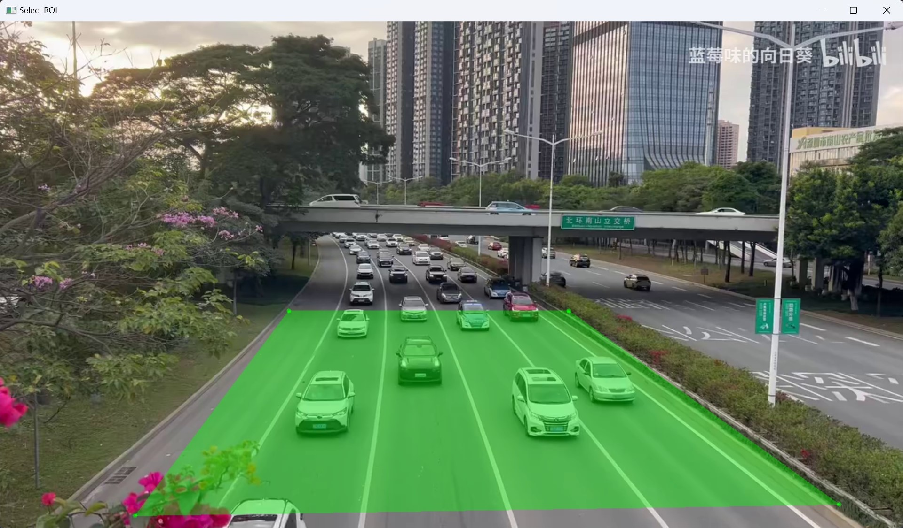
